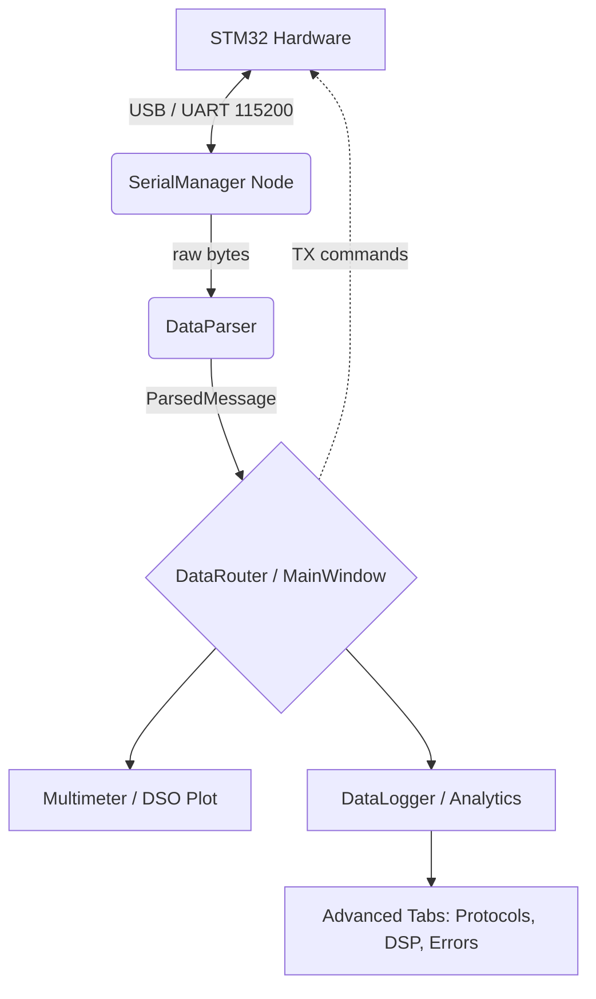

# STM32 Remote Lab v6.0 - System Documentation

This document explains the software architecture, the messaging protocol used to communicate with the STM32 via USB-UART, testing integration parameters, and custom plugin development rules.

## 1. System Architecture
The application runs as a synchronous event-driven suite bridging Qt (for visual widgets), PyQTGraph (for rapid GPU-accelerated array rendering), and PyVISA/WebSockets for multi-client sharing.



All DSP and arrays utilize `numpy` and `scipy` for non-blocking local evaluation. Due to the high flow rate, variables are funneled through the `AnalyticsEngine` capturing 500-sample `deque` sliding-windows. These variables provide the snapshot parameters exposed to panels calling `self._dso_source()` to receive the most contemporary waveform slice.

## 2. Remote Programmability & Cloud Relay

### Global MQTT NAT-Bypass Cloud Relay
Rather than forcing users to port-forward their routers, STM32 Lab implements a global Paho-MQTT Bridge bridging raw Python metrics out to **test.mosquitto.org**.
1. **Host:** Python client transmits encoded JSON snapshots representing current traces at 300ms intervals over port 1883.
2. **Client:** Remote users open `global_dashboard.html` on any device. WebSockets over WSS (port 8081) fetch the stream directly from the Mosquitto broker, enabling true bidirectional NAT-piercing.

## 2. UART Serial Message Framing
Communications are entirely ASCII-based to ensure backwards compatibility with standard terminal software (PuTTY/TeraTerm) acting as a fall-back.

### Incoming Format (STM32 to PC)
Messages from the microcontroller are semicolon-terminated, following a `#KIND:Key=Value,Key=Value;` schema:
* **Analog Samplings:** `#DATA:X=3.13;`
* **Errors:** `#ERR:Temp Sensor Failure;`
* **Boost Converters:** `#BOOST:V=5.50;`
* **Temperature:** `#TEMP:C=24.5;`

*Note: The Jupyter API module explicitly supports handling multiple rapid `\;`-terminated frames arriving inside the same OS serial poll buffer.*

### Outgoing Format (PC to STM32)
* `#MODE:T=V;`  (Set to Voltmeter)
* `#MODE:T=A;`  (Set to Ammeter)
* `#RANGE:V=12;` (Set max read limit to 12V)
* `#WAVE:T=SQ;` (Square wave)
* `#WAVE:F=400;` (Frequency to 400Hz)
* `#VREG:V=3.30;` (Regulated output out)

## 3. LXI / SCPI API Architecture
The platform integrates a zero-dependency Python `socketserver` binding against port `5025`. Because no binary padding is used, it exposes an authentic Test & Measurement format. Supported commands:
* `*IDN?` 
* `*RST`
* `SYST:ERR?` 
* `MEAS:VOLT:DC?`, `MEAS:FREQ?`, `MEAS:VOLT:AC?`
* `CONF:FREQ 400`, `CONF:VOLT:DC`
* `TRAC:DATA?` (Returns a CSV array of the last 500 voltages immediately).

### Jupyter Headless Architecture
To eliminate Qt overhead entirely on continuous integration devices, developers can trigger scripts interacting purely over the headless `STM32Lab` API. 
The internal background thread guarantees buffer consistency against the UART driver without relying on an external UI event pump. 

```python
lab = STM32Lab("ttyUSB0")
res = lab.sweep_freq(100, 1000) 
df = pd.DataFrame(res)
df.plot(x="freq_hz", y="mean_v")
```

## 5. Custom Sidebar Plugin Development

STM32 Lab v6.0 uses a highly modular `QStackedWidget` managed by the `PluginManager`. No core files need editing.
Plugins are auto-injected by dropping a `.py` script inside:
`~/.stm32lab/plugins/` (e.g., `C:\Users\<user>\.stm32lab\plugins\`)

A valid plugin only requires two functions:

```python
# ~/stm32lab/plugins/my_custom_tab.py
from PyQt5.QtWidgets import QWidget, QVBoxLayout, QLabel

def plugin_info():
    return {
        "name": "Phase Analyzer", 
        "version": "1.0",
        "author": "Lab Member"
    }

def create_tab(main_window):
    w = QWidget()
    lay = QVBoxLayout(w)
    lay.addWidget(QLabel("This pane was magically injected!"))
    return w
```

Once loaded, the plugin will automatically append itself to the Left Sidebar under the `[Plug]` prefix and swap seamlessly on click.

Users may interface with `main_window._analytics` or `main_window._dso_source` inside the `create_tab` function to bind GUI items against live hardware. 

## 5. Deployment Information
Logs, configurations, plugins, and SQLite databases are written exclusively into the user home `.stm32lab` directory to ensure local persistence and un-elevated system permissions.

1. **Configurations Data:** `~/.stm32lab/settings.json`
2. **Production DB:** `~/.stm32lab/prodtest/database.sqlite`
3. **Waveform DB:** `~/.stm32lab/wavedb.sqlite`

These folders can be shared across workstations to replicate state and historic records.
